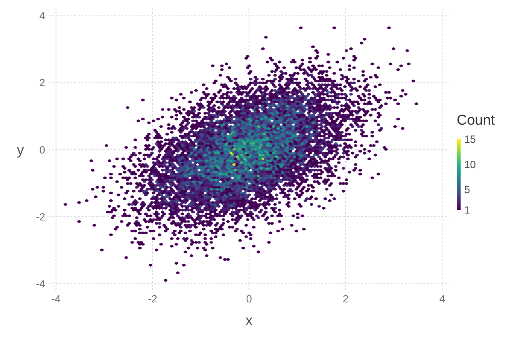

# Viridis

Viridis, Inferno, Magma, and Plasma color scales for Julia (`Colors.jl` &
`Gadfly.jl`).

Use:

~~~ julia
using Viridis
using Gadfly
using Distributions
X = rand(MultivariateNormal([0.0, 0.0], [1.0 0.5; 0.5 1.0]), 10000);
plot(x=X[1,:], y=X[2,:], Geom.hexbin, Scale.continuous_color(colormap=Viridis.inferno))
plot(x=X[1,:], y=X[2,:], Geom.hexbin, Scale.continuous_color(colormap=Viridis.plasma))
plot(x=X[1,:], y=X[2,:], Geom.hexbin, Scale.continuous_color(colormap=Viridis.magma))
plot(x=X[1,:], y=X[2,:], Geom.hexbin, Scale.continuous_color(colormap=Viridis.viridis))
~~~

